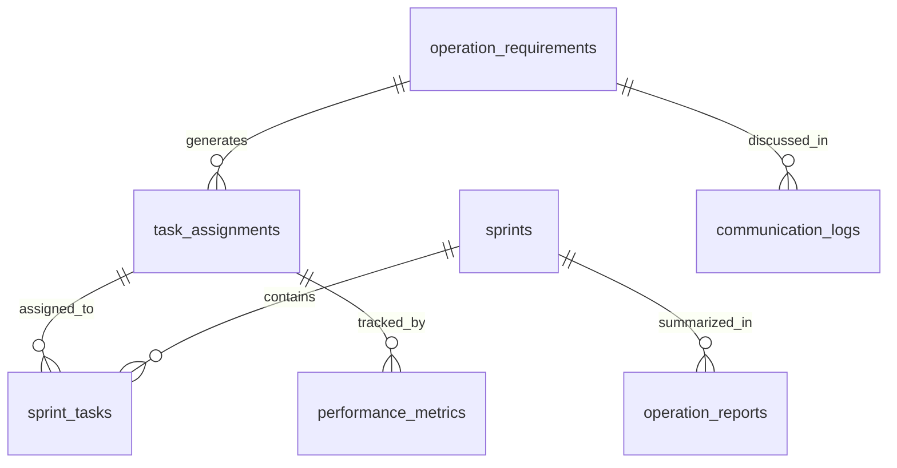

# 운영 관리 시스템 구현 가이드

## 🎯 개요

본 문서는 웹·앱 서비스 기획자 통합 플랫폼의 **운영 관리 (Operation Management)** 시스템에 대한 상세한 구현 가이드입니다. 6개의 핵심 컴포넌트를 통해 서비스 런칭 후 지속적인 운영 관리를 체계화합니다.

---

## 🏗️ 시스템 아키텍처

### 데이터베이스 구조



#### 핵심 테이블 구조

**1. operation_requirements (요건 관리)**

- 고객 요청사항의 전체 생명주기 관리
- 상태: submitted → in_review → approved/rejected → in_progress → completed

**2. task_assignments (업무 분배)**

- AI 기반 스마트 업무 할당
- 팀별 워크로드 균형 관리
- 스킬 매칭 알고리즘 적용

**3. sprints & sprint_tasks (일정 관리)**

- 스프린트 기반 일정 계획
- 리소스 충돌 감지 및 해결
- 캘린더 기반 시각화

**4. performance_metrics (성과 관리)**

- 8개 핵심 KPI 추적
- 팀 만족도 및 프로젝트 건강도 모니터링
- 실시간 알림 시스템

**5. communication_logs (커뮤니케이션)**

- 팀 내부 소통 채널 관리
- 회의 스케줄링 및 기록
- 파일 공유 및 알림 시스템

**6. operation_reports (운영 보고서)**

- 자동화된 보고서 생성 (주간/월간/분기별)
- 템플릿 기반 리포트 시스템
- PDF 내보내기 기능

---

## 📋 컴포넌트별 상세 가이드

### 1. RequirementTracker (요건 관리)

**목적**: 고객 요청사항을 체계적으로 수집, 분류, 추적하는 시스템

#### 주요 기능

- **요청 접수**: 다양한 형태의 고객 요구사항 입력
- **우선순위 관리**: 긴급도와 중요도 매트릭스 기반 분류
- **승인 워크플로우**: 단계별 검토 및 승인 프로세스
- **진행 추적**: 실시간 상태 업데이트 및 알림

#### 사용법

1. **요건 등록**: 'Add Requirement' 버튼으로 새 요건 등록
2. **상세 입력**: 제목, 설명, 우선순위, 담당자, 첨부파일 입력
3. **승인 프로세스**: 관리자 승인 후 작업 시작
4. **진행 추적**: 상태 변경 및 댓글을 통한 소통

```typescript
interface OperationRequirement {
  id: string
  title: string
  description: string
  priority: 'low' | 'medium' | 'high' | 'urgent'
  status:
    | 'submitted'
    | 'in_review'
    | 'approved'
    | 'rejected'
    | 'in_progress'
    | 'completed'
  requester: string
  assignee?: string
  attachments: string[]
  created_at: string
  due_date?: string
}
```

### 2. TaskDistribution (업무 분배)

**목적**: AI 기반 스마트 업무 할당 및 팀 워크로드 최적화

#### 주요 기능

- **스마트 할당**: 스킬 레벨과 현재 워크로드를 고려한 AI 할당
- **팀별 분류**: 기획/디자인/퍼블리싱/개발/QA 팀별 업무 분배
- **워크로드 균형**: 팀원별 업무량 시각화 및 균형 조정
- **칸반 보드**: 드래그 앤 드롭을 통한 직관적 업무 관리

#### AI 할당 알고리즘

```typescript
function calculateAssignmentScore(member: TeamMember, task: TaskAssignment) {
  const skillMatch = calculateSkillMatch(member.skills, task.required_skills)
  const workloadFactor = 1 - member.current_workload / 100
  const experienceFactor = member.experience_level / 5

  return skillMatch * 0.5 + workloadFactor * 0.3 + experienceFactor * 0.2
}
```

### 3. ScheduleManager (일정 관리)

**목적**: 스프린트 기반 일정 계획 및 리소스 충돌 관리

#### 주요 기능

- **스프린트 관리**: 2주 단위 스프린트 계획 및 실행
- **리소스 캘린더**: 팀원별 일정 시각화
- **충돌 감지**: 리소스 중복 할당 자동 감지
- **해결 제안**: AI 기반 일정 조정 제안

#### 스프린트 생명주기

1. **계획**: 목표 설정 및 태스크 할당
2. **실행**: 진행률 추적 및 일일 스탠드업
3. **리뷰**: 스프린트 회고 및 성과 분석
4. **개선**: 다음 스프린트 계획에 피드백 반영

### 4. PerformanceTracker (성과 관리)

**목적**: 다차원 성과 지표를 통한 종합적 프로젝트 건강도 모니터링

#### 8대 핵심 KPI

1. **완료율**: 계획 대비 실제 완료 비율
2. **품질 점수**: 버그 발생률 및 고객 만족도
3. **효율성**: 예상 시간 대비 실제 소요 시간
4. **고객 만족도**: NPS 점수 및 피드백 분석
5. **팀 만족도**: 팀원 만족도 설문 및 번아웃 지수
6. **예산 준수율**: 계획 예산 대비 실제 사용률
7. **일정 준수율**: 마일스톤 달성률
8. **혁신 지수**: 새로운 기술 도입 및 프로세스 개선

#### 알림 시스템

```typescript
const alertThresholds = {
  completion_rate: { warning: 70, critical: 50 },
  quality_score: { warning: 80, critical: 60 },
  team_satisfaction: { warning: 70, critical: 50 },
}
```

### 5. CommunicationHub (커뮤니케이션 허브)

**목적**: 팀 내외부 소통 채널 통합 관리

#### 주요 기능

- **채널 기반 메시징**: 프로젝트별/팀별 전용 채널
- **회의 스케줄링**: 자동 일정 조율 및 회의실 예약
- **파일 공유**: 드래그 앤 드롭 파일 업로드 및 버전 관리
- **알림 센터**: 실시간 알림 및 우선순위 관리

#### 채널 구조

- **#general**: 전체 공지사항
- **#project-[name]**: 프로젝트별 전용 채널
- **#team-[name]**: 팀별 내부 소통
- **#random**: 자유 소통 공간

### 6. OperationReport (운영 보고서)

**목적**: 자동화된 보고서 생성 및 경영진 대시보드 제공

#### 보고서 유형

- **주간 보고서**: 진행률, 이슈, 다음 주 계획
- **월간 보고서**: KPI 추이, 팀 성과, 예산 현황
- **분기별 보고서**: 전략적 인사이트, ROI 분석, 개선 계획

#### 템플릿 구조

```markdown
## Executive Summary

- 핵심 성과 지표
- 주요 이슈 및 해결방안
- 다음 기간 목표

## Detailed Metrics

- 정량적 지표 분석
- 트렌드 분석
- 벤치마킹 결과

## Team Performance

- 팀별 성과 분석
- 개인별 기여도
- 만족도 조사 결과
```

---

## 🔄 통합 워크플로우

### OperationWorkflow (메인 대시보드)

**목적**: 6개 컴포넌트를 통합하는 중앙 제어 패널

#### 주요 특징

- **단계별 네비게이션**: 체계적인 업무 흐름 가이드
- **통합 통계**: 모든 컴포넌트의 핵심 지표 요약
- **빠른 액세스**: 자주 사용하는 기능에 대한 단축 버튼
- **알림 센터**: 전체 시스템의 중요 알림 통합

#### 워크플로우 순서

1. **요건 관리** → 고객 요구사항 접수 및 분류
2. **업무 분배** → AI 기반 업무 할당
3. **일정 관리** → 스프린트 계획 및 일정 조정
4. **성과 추적** → KPI 모니터링 및 이슈 감지
5. **소통 관리** → 팀 커뮤니케이션 및 회의 관리
6. **보고서 생성** → 자동화된 성과 보고서 작성

---

## 🛠️ 기술적 구현 세부사항

### 컴포넌트 아키텍처

```typescript
// 공통 인터페이스 패턴
interface BaseComponent {
  data: any[]
  loading: boolean
  error: string | null
  onRefresh: () => void
}

// 상태 관리 패턴
const [activeView, setActiveView] = useState<'list' | 'kanban' | 'calendar'>(
  'list'
)
const [selectedItems, setSelectedItems] = useState<string[]>([])
const [filters, setFilters] = useState<FilterOptions>({})
```

### 공통 UI 패턴

#### 1. 상태 배지 (Status Badge)

```typescript
const getStatusColor = (status: string) => {
  const colors = {
    submitted: 'bg-blue-100 text-blue-800',
    in_review: 'bg-yellow-100 text-yellow-800',
    approved: 'bg-green-100 text-green-800',
    rejected: 'bg-red-100 text-red-800',
    in_progress: 'bg-purple-100 text-purple-800',
    completed: 'bg-gray-100 text-gray-800',
  }
  return colors[status] || 'bg-gray-100 text-gray-800'
}
```

#### 2. 우선순위 표시 (Priority Indicator)

```typescript
const getPriorityColor = (priority: string) => {
  return {
    low: 'text-green-600',
    medium: 'text-yellow-600',
    high: 'text-orange-600',
    urgent: 'text-red-600',
  }[priority]
}
```

#### 3. 진행률 바 (Progress Bar)

```typescript
const ProgressBar = ({ value, max = 100 }: { value: number; max?: number }) => (
  <div className="w-full bg-gray-200 rounded-full h-2">
    <div
      className="bg-blue-600 h-2 rounded-full transition-all duration-300"
      style={{ width: `${(value / max) * 100}%` }}
    />
  </div>
);
```

### 애니메이션 패턴

```typescript
// Framer Motion 공통 변형
const containerVariants = {
  hidden: { opacity: 0 },
  visible: {
    opacity: 1,
    transition: { staggerChildren: 0.1 },
  },
}

const itemVariants = {
  hidden: { opacity: 0, y: 20 },
  visible: { opacity: 1, y: 0 },
}
```

---

## 📊 성과 측정 및 분석

### KPI 대시보드

#### 실시간 지표

- **활성 요건 수**: 현재 진행 중인 요구사항
- **팀 워크로드**: 팀별 업무 부하 현황
- **스프린트 진행률**: 현재 스프린트 달성도
- **평균 응답 시간**: 요건 처리 속도

#### 트렌드 분석

- **주간 완료율 추이**: 생산성 변화 패턴
- **품질 지표 변화**: 버그 발생률 및 고객 만족도
- **팀 성장률**: 개인별 스킬 향상도

### 개선 권장사항

#### 1. 자동화 확장

- **AI 기반 요구사항 분석**: NLP를 활용한 자동 분류
- **예측적 일정 관리**: 과거 데이터 기반 일정 예측
- **지능형 알림**: 개인화된 알림 우선순위

#### 2. 통합 확장

- **외부 도구 연동**: Jira, Slack, GitHub 통합
- **API 개방**: 서드파티 도구와의 연동 지원
- **모바일 앱**: 언제 어디서나 접근 가능한 모바일 인터페이스

---

## 🚀 배포 및 운영 가이드

### 환경 설정

#### 필수 환경 변수

```bash
# Supabase 연동
NEXT_PUBLIC_SUPABASE_URL=your_supabase_url
NEXT_PUBLIC_SUPABASE_ANON_KEY=your_supabase_anon_key

# AI 서비스 연동
OPENAI_API_KEY=your_openai_key
ANTHROPIC_API_KEY=your_claude_key
```

#### 데이터베이스 마이그레이션

1. Supabase 프로젝트 생성
2. SQL 스크립트 실행
3. RLS (Row Level Security) 정책 적용
4. 초기 데이터 삽입

### 배포 체크리스트

- [ ] 환경 변수 설정 확인
- [ ] 데이터베이스 마이그레이션 완료
- [ ] TypeScript 컴파일 오류 없음
- [ ] ESLint 검증 통과
- [ ] 핵심 기능 동작 테스트
- [ ] 성능 최적화 적용
- [ ] 보안 설정 확인

### 모니터링

#### 성능 모니터링

- **응답 시간**: 각 컴포넌트별 로딩 시간
- **메모리 사용량**: 클라이언트 측 메모리 최적화
- **API 호출 횟수**: 불필요한 요청 최소화

#### 에러 추적

- **JavaScript 에러**: 클라이언트 측 에러 로깅
- **API 에러**: 서버 응답 에러 추적
- **사용자 행동**: 이벤트 기반 사용 패턴 분석

---

## 🎯 향후 발전 방향

### 단기 개선 계획 (3개월)

- **모바일 최적화**: 반응형 디자인 개선
- **실시간 협업**: WebSocket 기반 실시간 업데이트
- **오프라인 지원**: PWA 기능 추가

### 중기 발전 계획 (6개월)

- **AI 고도화**: GPT-4 기반 자연어 처리 강화
- **예측 분석**: 머신러닝 기반 성과 예측
- **워크플로우 자동화**: 룰 엔진 기반 자동 처리

### 장기 비전 (1년)

- **Enterprise 기능**: 대기업용 고급 기능
- **다국어 지원**: 글로벌 서비스 확장
- **플랫폼 생태계**: 파트너사와의 통합 플랫폼 구축

---

## 📚 참고 자료

### 기술 문서

- [Next.js 15 Documentation](https://nextjs.org/docs)
- [Supabase Documentation](https://supabase.com/docs)
- [TypeScript Handbook](https://www.typescriptlang.org/docs)
- [Tailwind CSS Guide](https://tailwindcss.com/docs)

### 설계 원칙

- [React Design Patterns](https://reactpatterns.com)
- [TypeScript Best Practices](https://typescript-cheatsheets.netlify.app)
- [Database Design Principles](https://www.sqlstyle.guide)

### 성과 관리 방법론

- [OKR (Objectives and Key Results)](https://www.okr.com)
- [Agile Project Management](https://www.atlassian.com/agile)
- [DevOps Best Practices](https://azure.microsoft.com/en-us/overview/devops)

---

**문서 버전**: v1.0  
**마지막 업데이트**: 2025-08-25  
**작성자**: Claude AI Assistant  
**검토자**: Development Team

이 가이드는 운영 관리 시스템의 전체적인 이해와 효과적인 활용을 위한 종합 매뉴얼입니다. 추가 질문이나 기능 개선 요청이 있으시면 언제든지 문의해 주세요.
